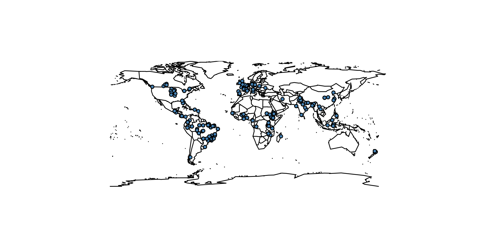

```{r setup, include=FALSE}
knitr::opts_chunk$set(echo = TRUE)
```

# Title

# Abstract
<!-- Thiago, this we write at the ende  -->

# Introduction

## Agroforestry and SOC

## Introducing the problem: it is difficult to relate the SOC stocks with AFS treatments

### Variability
* "Agroforestry" defines a very broad range of diverse agronomical practices
* The C inputs in each practice can vary a lot

### Limited data availability over time and space
* AFS, although traditional in many cases, it is a recent interest in the scientific literature. 
* SOC time scale is decades to centuries
* Lack of long term experiments
* Lack of real (diachronic) control in experiments (why is this bad)

### What does this cause? + state of the art

## What we did to solve it

### We collected more data

### We integrated the data with more sources (SoilGrids)

### We analyzed the data with a nonparametric ML technique

### We decomposed the variance of the models

## Hypotheses

### We can predict the increase in C stocks as consequence of AFS treatment with few variables (Which?)

### We can improve the precision of the predictions with information from a global edaphic database (SOilGrids)


# Materials and Methods

## Data mining
This study was initially conducted with a literature review aiming studies related to AFS and SOC Stocks, including SOC Content and bulk density. Among the research engines, for this study it was used: ISI—Web of Knowledge, Google Scholar, Scopus, Research Gate, and Scielo.org. 
In order to increase the number of potential references, it was used the following keywords: soil AND (‘carbon stock\*’ OR ‘carbon pool\*’ OR ‘carbon sequestration’ OR ‘carbon concentration’) AND (agroforest* OR parkland* OR homegarden OR multistrata OR hedgerow OR windbreak OR shelter-belt OR ‘live fence’ OR ‘tree intercrop\*’ OR silvo\*arable OR silvo\*pasture OR ‘rotation\*wood\*’ OR tree\*fallow\* OR fallow OR (tree* AND ‘improve* fallow\*’) OR (tree\* AND relay\*crop\*) OR (tree\* AND alley\*crop\*)) (Cardinael et al., 2019). 
Them it was filled a table with several parameters found in the papers, including Location, Climate Classification according to Köppen, Physical Property of the Soil, AFS Description, Previous Land Use, Age of System, SOC Stock from the AFS and from the Control plot, following the IPCC guidelines (IPCC, 2022). 
<!-- Thiago, here we need to document precisely the numbers. How many entries from Remi's work, how many new ones.  -->
Over 400 peer reviewed papers have been examined and 174 have been considered adequate for this study. The eligibility of the papers was the presence of SOC Stocks data, measured in the AFS and a control area (synchronic); or SOC data sampled before and after the AFS implementation (diachronic). 




## Data treatment

### Outliers detection

### Integration with variables from the SoilGrids database

## Random forest model development

### Introducing the method briefly

### The different models we tested
```{r echo = FALSE, results = 'asis'}
library(knitr)
validations<-read.csv("../models.csv")
kable(validations, caption = "")
```


#### The variables we considered
```{r echo = FALSE, results = 'asis'}
library(knitr)
validations<-read.csv("../table_variables.csv")
kable(validations, caption = "The variables")
```

#### Predicting the stocks difference  
We tested how the differences in C stocks (after AFS treatment and before, assuming that the control treatment from each study was representative of the previous state of the system) can be predicted by a trained model.  
Models were all in the form
$$\Delta_{stocks} \sim f(variable_1, variable_2, variable_{...})$$


#### Predicting the AFS stocks accumulation 
Models were all in the form
$$AFS_{stocks} \sim f(variable_1, variable_2, variable_{...})$$


#### Predicting the AFS stocks accumulation but without including information about previous land use


### Validation approach: fully independent, stratified by cluster


# Results
## The performances of the models on the validation dataset

* The models did not manage to predict reasonably the $\Delta$ in stocks, but they did manage to predict the C stocks after a certain time of agroforestry treatment
* The models perform relatively well (better than random, there is some information) even on a fully independent dataset
* There was virtually no information added from the SoilGrids dataset
* Removing the previous land use information still retains a model with some value (although of course worse than with such information)

```{r echo = FALSE, results = 'asis'}
library(knitr)
validations<-read.csv("../validation_results.csv")
kable(validations, caption = "A knitr kable.")
```


## Decomposing the explained variance: the relative variable importance

### Predicting the stocks difference
Stocks difference, without SoilGrids data	
{width=40%}  

Stocks difference, with SoilGrids data	
{width=40%}  
### Predicting the AFS stocks (including information about previous land use)
Stocks after AFS, without SoilGrids data	
{width=40%}  
Stocks after AFS, with SoilGrids data	 
{width=40%}  
Stocks after AFS, with only clay from SoilGrids data	
{width=40%}  
### Predicting the AFS stocks (but without information about previous land use)

Stocks after AFS, no previous land use but with SoilGrids data	
{width=40%}  
Stocks after AFS, no previous land use	
{width=40%}  


# Discussion

## The $\Delta$ in stocks


## The information from the SoilGrids dataset


## The models as a predictive tool

### Considering previous land use

### Ignoring previous land use


# Conclusions

