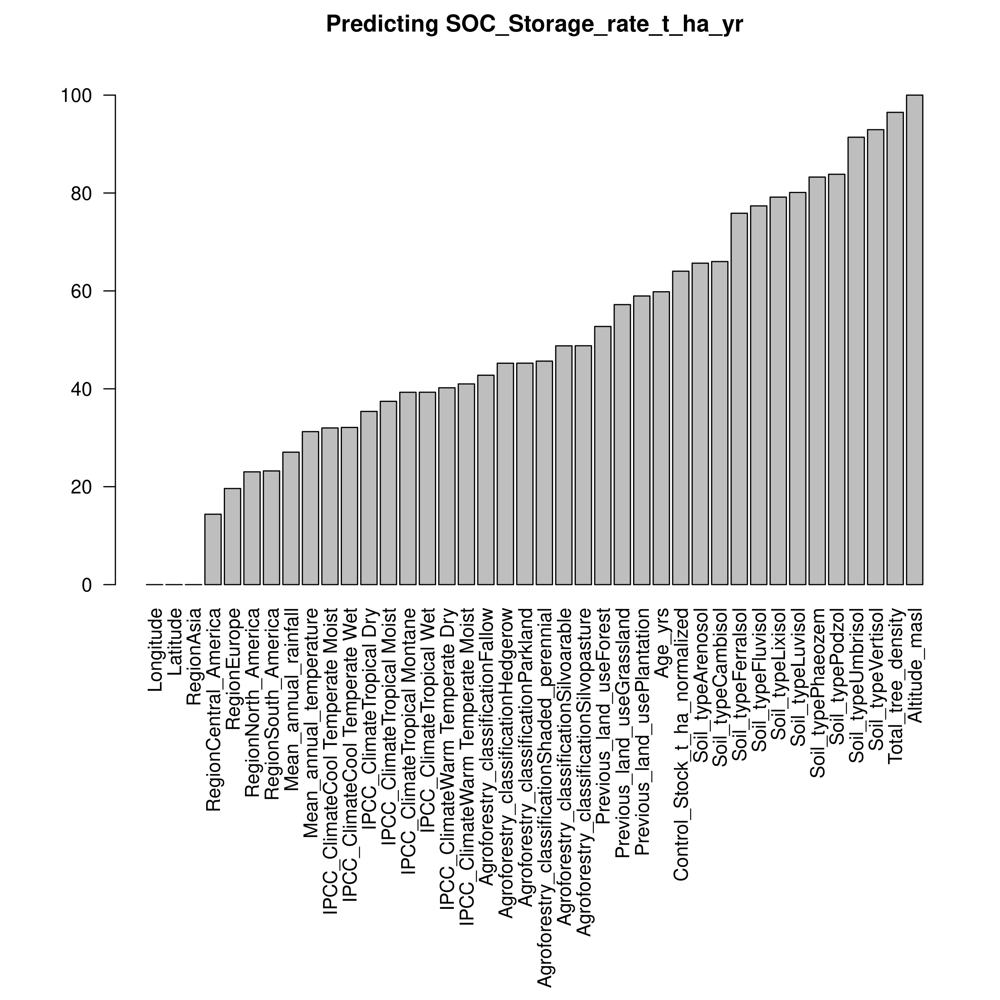
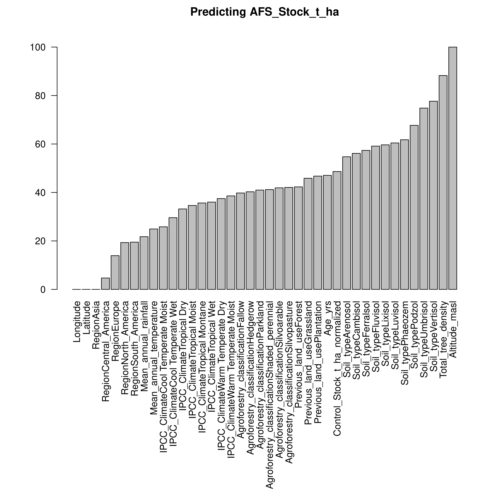
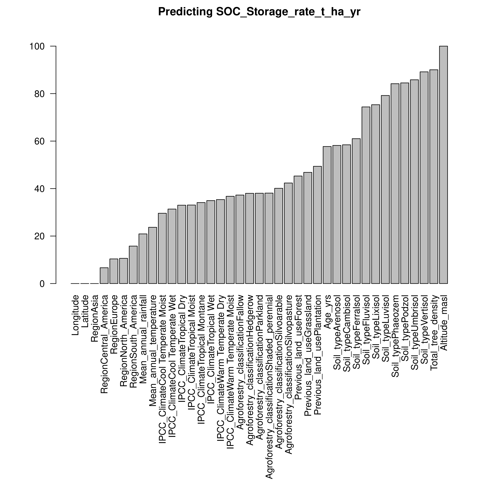
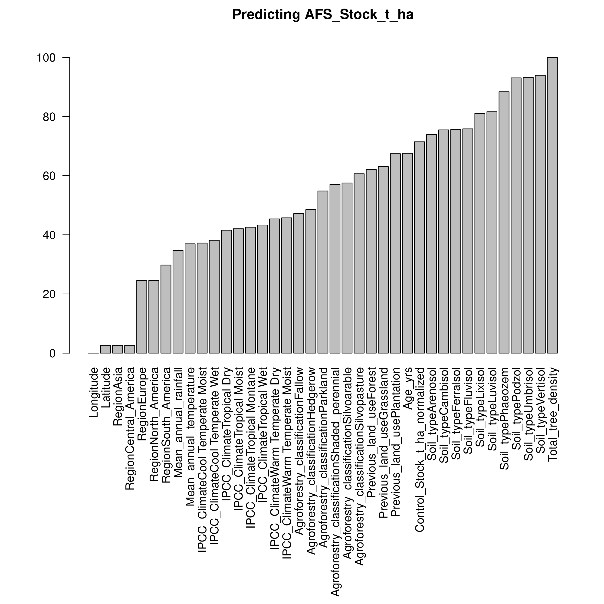
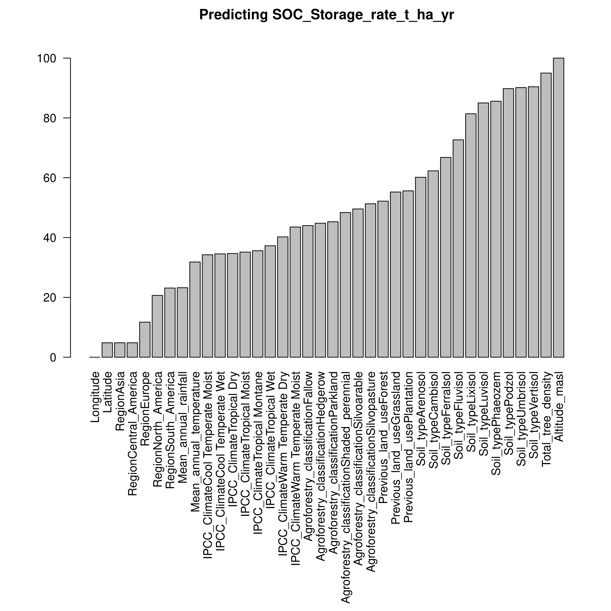
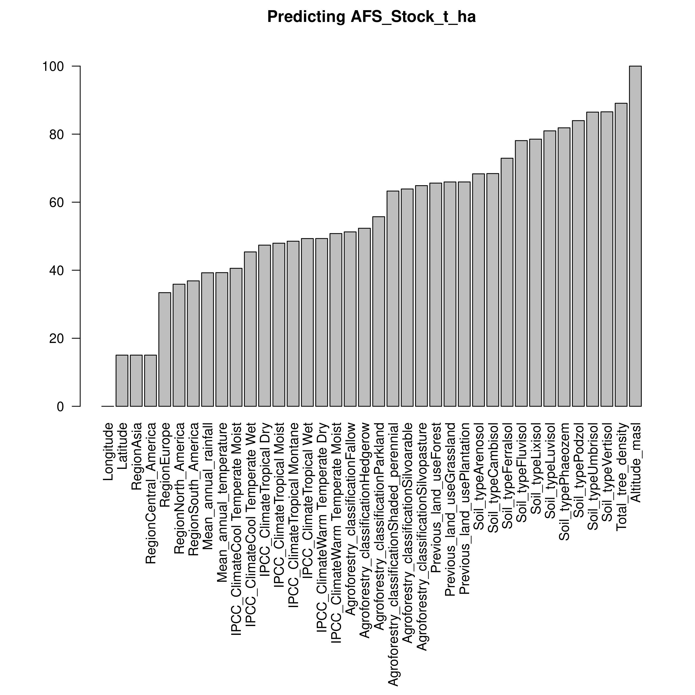
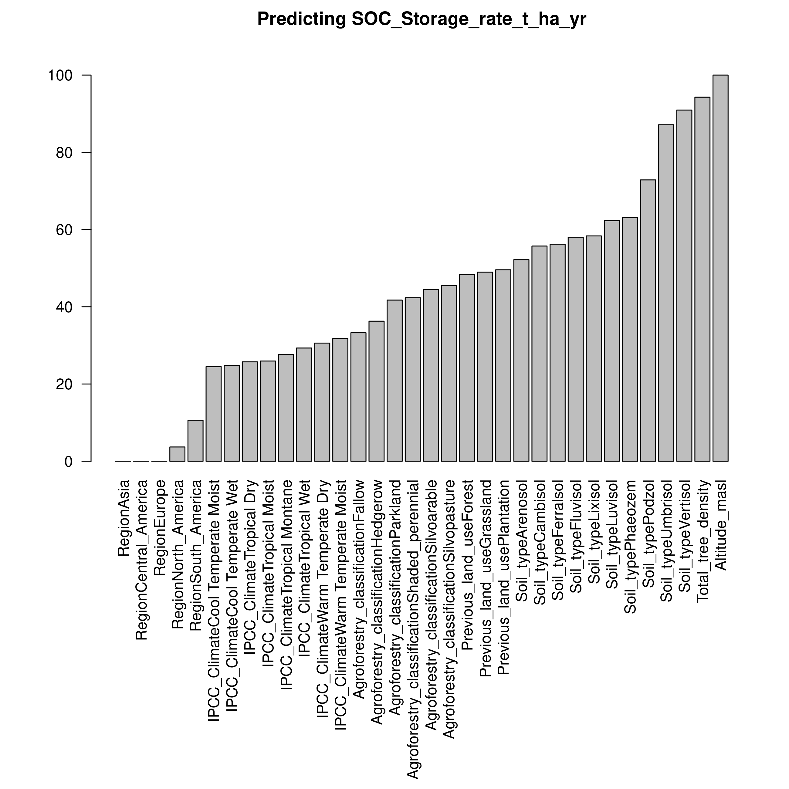
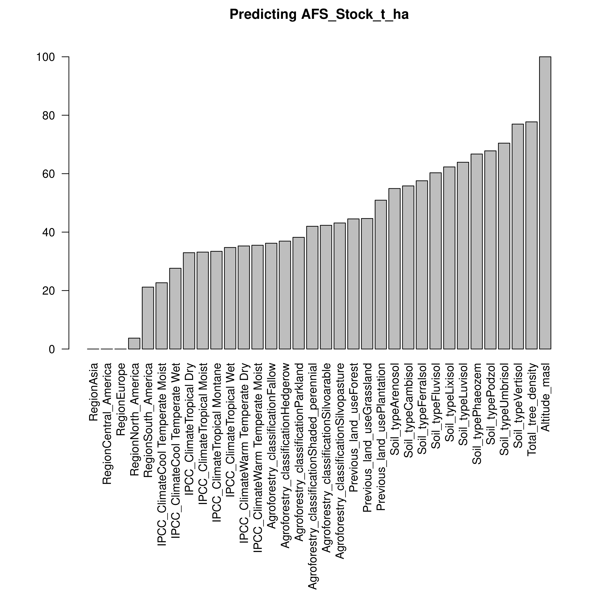
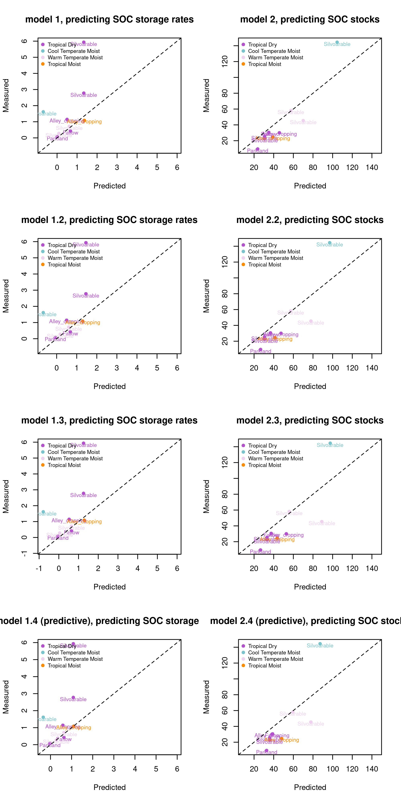

---
title: "Preliminary report"
output:
  html_document:
    df_print: paged
  pdf_document: default
--- 
    

```{r setup, include=FALSE}
knitr::opts_chunk$set(echo = TRUE)
knitr::opts_chunk$set(fig.pos = "!H", out.extra = "", root.dir = "./docs/")
getwd()
load("workspace.RData")

```


## Intro

This is a quick and dirty report from the preliminary data analysis, built with RMarkdown language. It is just meant for internal reporting, to collect together the results for discussion and to explain them briefly with captions.

I modify slightly the data: when there are two altitudes reported in the same cell, I use the average of the two  

The first step is to normalize the C stocks and sequestration rates by depth. I do so using the calibrated equation 1 from te following reference: 
Mishra, U., Lal, R., Slater, B., Calhoun, F., Liu, D., & Van Meirvenne, M. (2009). Predicting Soil Organic Carbon Stock Using Profile Depth Distribution Functions and Ordinary Kriging. Soil Science Society of America Journal, 73(2), 614–621. https://doi.org/10.2136/sssaj2007.0410  
I calculate the integral of such equation over 20 cm:  
$C_{0,Z}= \int_{0}^{Z} a e^-bZ$  
and the integral over each depth considered in the table, and then calculate the ratio:  
$r= \frac{\int_{0}^{20} a e^-b\cdot 20}{\int_{0}^{Z} a e^-bZ}$  
Which I then use to multiply all the values involvinc C stocks (both stocks and sequestration rates).  

## Random forest model calibration and optimization

The RF models are trained with the Caret package

```{r eval=FALSE}
#Random Forests analysis
model1<-randomForest(SOC_Storage_rate_t_ha_yr ~ ., data=cardinael_data_subset[,-13])
model2<-randomForest(AFS_Stock_t_ha ~ ., data=cardinael_data_subset[,-13])
```

The following are the selected variables for the plots after some discussion between me and Remi:
```{r echo=T}
selected_names
```

`model1` considers all the variables we decided to include except `AFS_Stock_t_ha` in order to predict the SOC sequestration rate `SOC_Storage_rate_t_ha_yr`.  
`model2` considers all the variables we decided to include (including of course in this case `AFS_Stock_t_ha`) in order to predict the SOC stocks after agroforestry LUC `AFS_Stock_t_ha`.

## Random forest results of comprehensive models
{width=600px}  


{width=600px}


We then proceed to exclude the previous SOC stocks `Control_Stock_t_ha` , which are of course a rather important determinant of the SOC situation and possibly also of the emissions at a certain time, and we proceed to create all version x.2 of the models.

```{r eval=FALSE}
#subsetting the dataset for escluding previous SOC
which_exclude_2<-which(names(cardinael_data_subset) %in% c("Control_Stock_t_ha"))
cardinael_data_subset_2<-cardinael_data_subset[,-which_exclude_2]
#Random Forests analysis
model1.2<-randomForest(SOC_Storage_rate_t_ha_yr ~ ., data=cardinael_data_subset_2)
model2.2<-randomForest(AFS_Stock_t_ha ~ ., data=cardinael_data_subset_2)
```

## Random forest results of models not considering previous stocks

This model considers the following variables:
```{r echo=T}
colnames(cardinael_data_subset_training_2)
```

{width=600px}  


{width=600px}


We then exclude (on top of revious SOC stocks `Control_Stock_t_ha` ) also the age of the stocks `Age_yrs` , and we proceed to create all version x.3 of the models.
```{r eval=FALSE}
#subsetting the dataset for escluding age
which_exclude_3<-which(names(cardinael_data_subset_2) %in% c("Age_yrs"))
cardinael_data_subset_3<-cardinael_data_subset_2[,-which_exclude_3]
names(cardinael_data_subset_3)
#Random Forests analysis
model1.3<-randomForest(SOC_Storage_rate_t_ha_yr ~ ., data=cardinael_data_subset_3[,-11])
model2.3<-randomForest(AFS_Stock_t_ha ~ ., data=cardinael_data_subset_3)

```

## Random forest results of models not considering previous C stocks nor age (time elapsed)

This model, to predict C sequestration rates, considers the following variables:
```{r echo=T}
colnames(cardinael_data_subset_training_3)
```


{width=600px}  


{width=600px}


## Random forest results of minimal model
I also prepared a version of a predictive model with less parameters.
This model considers the following variables:
```{r echo=T}
colnames(cardinael_data_subset_training_4[,-which_to_remove1.4])
```

{width=600px}  

While this one, to predict C stocks, considers the folloiwing:
```{r echo=T}
colnames(cardinael_data_subset_training_4[,-which_to_remove2.4])
```


{width=600px}


## Predictions

I test the six developed model on a 10% of the sites, kept separated from the training dataset, for an independent validation:
{width=600px}  

The information in the data seems rather redundant since the RMSE of the models does not change much by reducing the selected parameters (here as R^2):


```{r echo=F}
knitr::kable(
  table_RMSE, caption = 'The R^2 of the models considered here'
)
```


```{r check-wd}
getwd()
```


